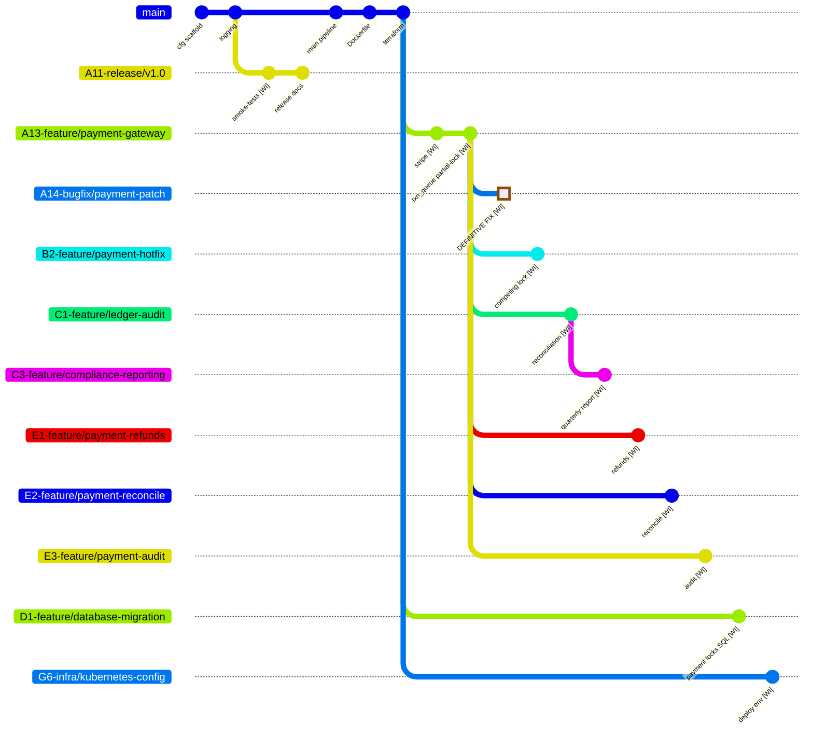
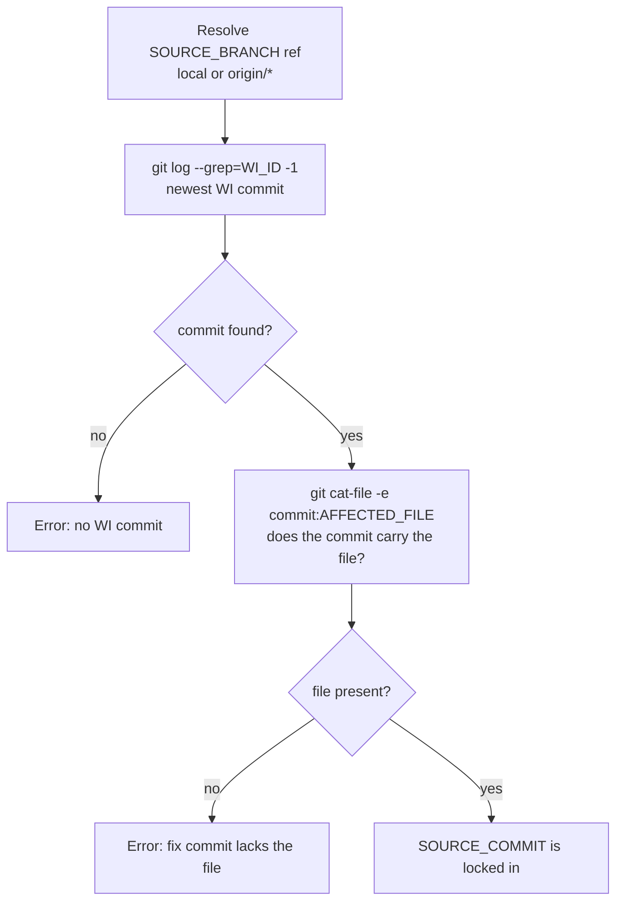
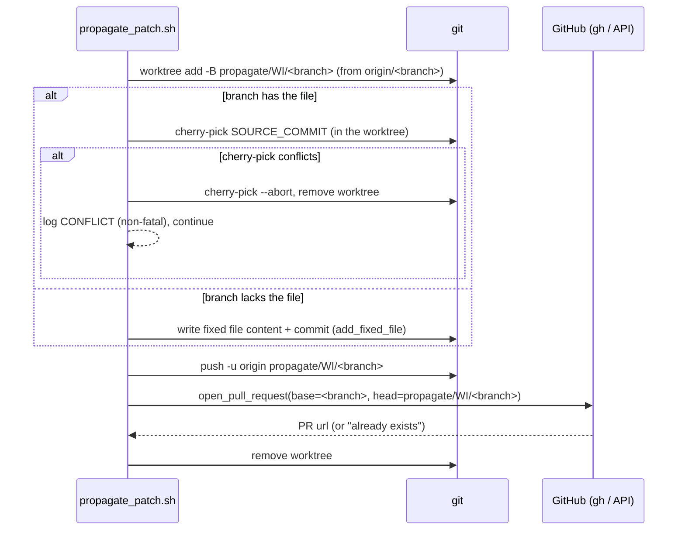
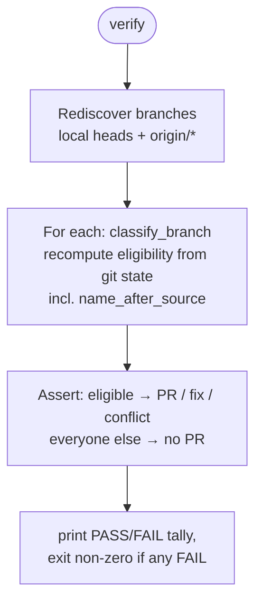
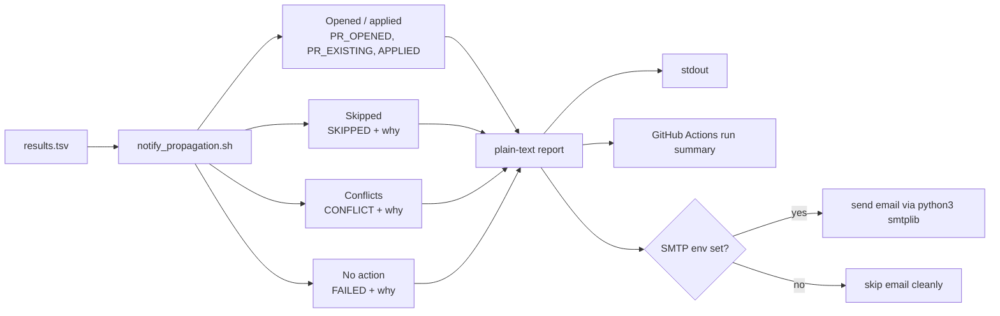
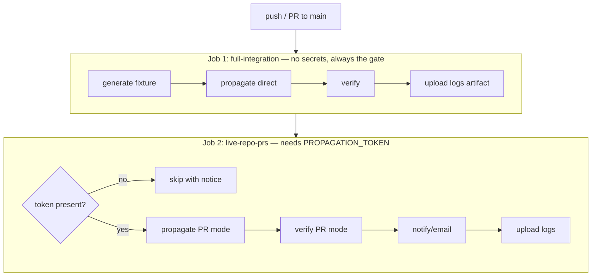
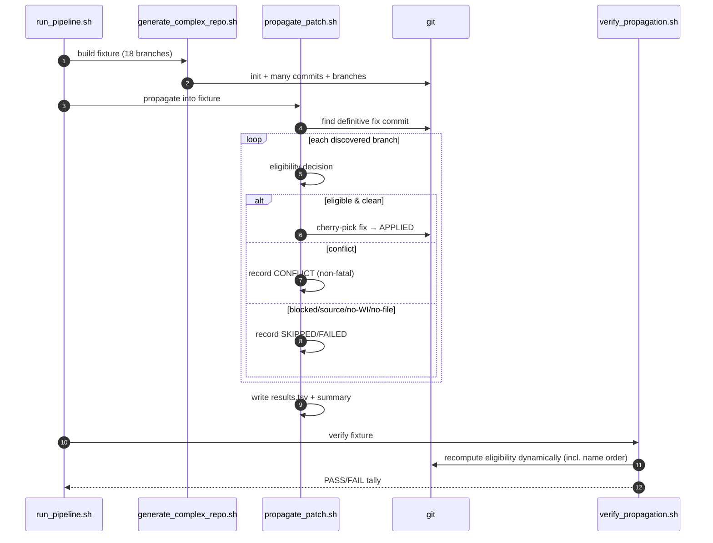

# Architecture & Code Walkthrough

A complete, detailed explanation of how this project works — what every file
does, how the functions fit together, and how the pieces connect end to end.
Diagrams are written in [Mermaid](https://mermaid.js.org/) and render on GitHub.

> **TL;DR** — This repo is a *self-contained test harness* for **cross-branch
> patch propagation**. One script **builds** a fake 18-branch enterprise repo,
> a second **finds a bug-fix commit and copies it** onto every branch that
> should get it, a third **checks** the result, a fourth **reports/emails** it,
> and a GitHub Actions workflow **runs the whole thing in CI**.

---

## 1. The big picture

Imagine a large company with one Git repository and many active branches
(payments, auth, analytics, infra…). A critical bug is fixed on one branch.
**Which other branches need that same fix, and how do we apply it safely?**

This project answers that question with plain Bash + Git. It has two halves:

| Half | What it is | Files |
|------|-----------|-------|
| **The fixture** | A synthetic repo that *looks like* a messy enterprise repo | `generate_complex_repo.sh` |
| **The tooling** | Scripts that find, apply, verify, and report the fix | `scripts/*.sh` |

Everything is driven by one **work item**, `WI-440219`, and one **affected
file**, `src/payment/transaction_queue.py`.

---

## 2. Repository layout

```
complex-test-repo/
├── generate_complex_repo.sh        # Builds the 18-branch fixture from scratch
├── scripts/
│   ├── propagate_patch.sh          # Finds the fix and applies it (direct or PR)
│   ├── verify_propagation.sh       # Asserts the expected outcome
│   ├── notify_propagation.sh       # Builds a report + optional email
│   └── run_pipeline.sh             # Local: generate → propagate → verify
├── .github/workflows/
│   └── patch-propagation.yml       # CI: integration test + live PR opening
├── README.md                       # User-facing usage guide
├── ARCHITECTURE.md                 # This document
└── .gitignore                      # Ignores generated fixtures & logs
```

Everything else you might see on disk (`.generated-fixture*/`,
`.propagation-logs/`, a nested `complex-test-repo/`) is **generated output** and
is git-ignored. It is safe to delete at any time — the scripts recreate it.

---

## 3. Core concepts (the vocabulary)

| Term | Meaning | Default |
|------|---------|---------|
| **Work item (`WI_ID`)** | The ticket ID that tags related commits | `WI-440219` |
| **Source branch** | Branch that contains the *definitive* fix | `A14-bugfix/payment-patch` |
| **Affected file** | The file the fix changes | `src/payment/transaction_queue.py` |
| **Fix marker** | Exact line that proves the definitive fix is present | `threading.RLock()  # WI-440219: definitive thread-safe fix` |
| **Fix commit** | Newest commit on the source branch that mentions the WI in its message | selected at runtime |
| **Target / eligible branch** | A branch that *should* receive the fix | computed dynamically |
| **Propagation mode** | How the fix is applied: `direct` (cherry-pick) or `pr` (open a PR) | `direct` |
| **Branch select mode** | How targets are chosen: `wi-history` or `affected-file` | `wi-history` |

The key trick: the bug fix is *one commit*. "Propagating" it means
**cherry-picking that commit** onto other branches — either straight onto the
branch (direct) or onto a throw-away branch that then becomes a Pull Request.

---

## 4. The fixture: what `generate_complex_repo.sh` builds

This script throws away any existing target directory and builds a brand-new Git
repo with **18 branches** designed to exercise every interesting case.

### 4.1 Branch tree (who forks from whom)



The letter+number prefix encodes order: the fix branch is `A14-`, so only
branches whose prefix sorts **after** `A14` (`B2-`, `C1-`, `C3-`, `D1-`, `E1-`,
`E2-`, `E3-`, `G6-`) can be eligible; `A11-`/`A12-`/`A13-` sort *before* the fix
and are excluded by name. The comparison is byte-wise (`LC_ALL=C`), so letters
order exactly like digits: `A14` < `B2` < `C1` < `E3` < `G6`. The `E*` branches
fork from the gateway, so they carry the pre-fix file and cherry-pick cleanly.

*(The other branches — `A12-feature/user-auth`, `B3-feature/ui-ux`,
`B4-feature/analytics-pipeline`, `C2-feature/notifications`,
`C4-feature/mobile-api`, `D2-feature/admin-dashboard` — all fork from `main` and
contain **no** WI commits. They exist as "noise" that must be correctly
ignored.)*

### 4.2 The three states of `transaction_queue.py`

The whole test hinges on what each branch's copy of the affected file looks like:

| State | Lock line | Branches | Propagation result |
|-------|-----------|----------|--------------------|
| **Pre-fix** | `threading.Lock()  # ... partial lock — race remains` | `A13-feature/payment-gateway`, `C1-feature/ledger-audit`, `C3-feature/compliance-reporting`, `E1-feature/payment-refunds`, `E2-feature/payment-reconcile`, `E3-feature/payment-audit` | cherry-pick applies cleanly ✅ (when also eligible by name) |
| **Definitive fix** | `threading.RLock()  # ... definitive thread-safe fix` | `A14-bugfix/payment-patch` (source) | already fixed |
| **Competing** | `threading.Semaphore(1)` hotfix that diverges | `B2-feature/payment-hotfix` | cherry-pick conflict ⚠️ |
| **Absent** | file does not exist | `A11-release/v1.0`, `D1-feature/database-migration`, `G6-infra/kubernetes-config` + all no-WI branches | file added with the fix ➕ (when eligible) |

### 4.3 Why each "interesting" branch exists

| Branch | Name after `A14-`? | WI in history? | Has the file? | Purpose in the test |
|--------|:---:|:---:|:---:|---------------------|
| `A14-bugfix/payment-patch` | — | ✅ | ✅ (fixed) | **Source** of the fix — skipped |
| `A11-release/v1.0` | ❌ | ✅ | ❌ | **Name sorts before fix** — excluded by name order |
| `A13-feature/payment-gateway` | ❌ | ✅ | ✅ pre-fix | **Name sorts before fix** (the fix's own parent) — excluded |
| `C1-feature/ledger-audit` | ✅ | ✅ | ✅ pre-fix | Happy path — gets the fix |
| `C3-feature/compliance-reporting` | ✅ | ✅ | ✅ pre-fix | Happy path — gets the fix |
| `E1-feature/payment-refunds` | ✅ | ✅ | ✅ pre-fix | Happy path — gets the fix |
| `E2-feature/payment-reconcile` | ✅ | ✅ | ✅ pre-fix | Happy path — gets the fix |
| `E3-feature/payment-audit` | ✅ | ✅ | ✅ pre-fix | Happy path — gets the fix |
| `D1-feature/database-migration` | ✅ | ✅ | ❌ | Eligible but **lacks the file** — file added, still gets a PR |
| `B2-feature/payment-hotfix` | ✅ | ✅ | ✅ competing | **Conflict** case — reported, non-fatal |
| `G6-infra/kubernetes-config` | ✅ | ✅ | ❌ | **Policy block** case — skipped on purpose |
| 6 other branches | mixed | ❌ | ❌ | **Noise** — must be ignored |

This gives a known-good fixture: **11 branches mention the WI**, but only those
whose **name sorts after `A14-`** *and* mention the WI are eligible — so **6
receive the fix** (`C1-feature/ledger-audit`, `C3-feature/compliance-reporting`,
`D1-feature/database-migration`, `E1-feature/payment-refunds`,
`E2-feature/payment-reconcile`, `E3-feature/payment-audit`),
`B2-feature/payment-hotfix` conflicts, `G6-infra/kubernetes-config` is blocked,
and `A11-release/v1.0` / `A13-feature/payment-gateway` are excluded because their
names sort on/before the fix branch. The run opens one PR per eligible branch
(6 with this fixture); there is no minimum-PR gate.

### 4.4 Functions inside `generate_complex_repo.sh`

| Function | Job |
|----------|-----|
| `verify_nested_git_dir` | Safety check: confirms commits land in the fixture's own `.git`, not a parent checkout (critical when CI sets `GIT_*` env vars) |
| `init_repo` | Deletes any old target, `git init -b main`, sets identity, seeds the directory tree |
| `append_to_file <path> <lines…>` | Appends content (with a timestamp header) to a file, creating parent dirs |
| `commit_change <msg> <file> <lines…>` | The workhorse: append → `git add` → `git commit` |
| `new_branch <name> [parent]` | `git switch` to parent (if given) then create the new branch |
| `list_wi_commits` | Lists all commits mentioning the WI across branches (final report) |
| `print_branch_graph` | `git log --graph` over all branches (final report) |
| `section <title>` | Pretty banner printed between phases |

The bottom ~800 lines are just **data**: many `commit_change` calls that give
each branch realistic content. The logic is the handful of helpers above.

---

## 5. The heart: `propagate_patch.sh`

This is where the actual propagation happens. It runs in one of two modes.

### 5.1 Setup & configuration (top of file)

Everything is overridable via environment variables (with sensible defaults):
`WI_ID`, `SOURCE_BRANCH`, `AFFECTED_FILE`, `FIX_MARKER`, `BRANCH_SELECT_MODE`,
`PROPAGATION_MODE`, `BLOCKED_BRANCHES`, `DRY_RUN`. It then creates a
`.propagation-logs/` directory and four output files:

| File | Contents |
|------|----------|
| `propagation-summary.txt` | Human-readable log (everything the `log()` helper prints) |
| `wi-target-branches.txt` | Branches whose history mentions the WI |
| `pull-requests.txt` | `branch|url` lines for opened/existing PRs |
| `results.tsv` | **Machine-readable** `status⇥branch⇥reason⇥url` — the contract between scripts |

`results.tsv` is the key integration point: `verify_propagation.sh` and
`notify_propagation.sh` both read it.

### 5.2 Finding the fix commit



The selection rule is simply **"the newest commit on the source branch whose
message mentions the WI."** There is no marker check — the latest WI-tagged
commit *is* the fix. The only extra requirement is that this commit actually
contains the affected file, because its content is what gets propagated.

### 5.3 Eligibility: should a branch get the fix?

For every discovered branch (`list_branches` returns local heads + `origin/*`),
the script decides what to do. The decision order is what makes the negative
cases work:


Helper predicates that drive this (all small one-liners near the middle):

| Function | Returns true when… |
|----------|--------------------|
| `branch_mentions_wi` | the branch's commit history has ≥1 commit mentioning the WI |
| `name_after_source` | the branch name sorts strictly **after** `SOURCE_BRANCH` (byte-wise, `LC_ALL=C`) — the letter+number-prefix ordering rule |
| `branch_has_file` | the affected file exists on the branch |
| `branch_has_fix` | the affected file already contains the fix marker |
| `is_blocked` | branch is in `BLOCKED_BRANCHES` |
| `is_protected` | branch is in `PROTECTED_BRANCHES` (e.g. `main`) — never gets the fix |
| `is_propagation_branch` | branch name starts with `propagate/` |
| `should_target_branch` | combines all of the above for the chosen select mode |
| `add_fixed_file` | writes the file's full fixed content (from the fix commit) and commits it — used when the branch lacks the file |

### 5.4 Applying the fix — two modes

**Direct mode (`apply_direct`)** — checkout the branch, then either:
- if the branch **has** the file → `git cherry-pick` the fix (a competing change
  makes this conflict, logged as `FAIL`/`CONFLICT`), or
- if the branch **lacks** the file → `add_fixed_file` writes the full fixed
  content and commits it (logged as `ADD`).

On success it logs `APPLY`/`ADD`; on cherry-pick conflict it aborts and reports.

**PR mode (`apply_via_pr`)** — never touches the real branch. Instead:



Supporting functions for PR mode:

| Function | Job |
|----------|-----|
| `github_repo_slug` | Derive `owner/repo` from `GITHUB_REPOSITORY` or the `origin` URL |
| `propagation_branch_name` | Build `propagate/<WI>/<branch-with-slashes-as-dashes>` |
| `branch_to_prop_slug` | Turn `feature/x` into `feature-x` for branch names |
| `pr_title` / `pr_body` | Compose the PR title and Markdown body |
| `open_pull_request` | Use `gh` CLI if present, else the GitHub REST API via `curl`; detects an existing open PR to stay idempotent; honors `DRY_RUN` |
| `branch_ref` / `branch_check_ref` | Resolve a name to a local or `origin/*` ref (PR mode prefers `origin/*` so stale locals can't hide a missing fix) |

### 5.5 Outcome classification & exit code

Each branch's result is recorded to `results.tsv` with one of these statuses:

`APPLIED` · `PR_OPENED` · `PR_EXISTING` · `SKIPPED` · `CONFLICT` · `FAILED`

`classify_failure` decides between a **conflict** (branch has the file but the
cherry-pick clashed — non-fatal, needs a human) and an **unexpected failure**
(anything else — fatal). A branch missing the file no longer fails: it gets the
file added instead.

The script's exit code policy:

- Conflicts are **reported but never fail** the run.
- The PR count is **never** a failure condition — the run passes for whatever
  number of eligible PRs it opens (including zero).
- Any *unexpected* failure **is** a failure.

---

## 6. The checker: `verify_propagation.sh`

This asserts the propagation produced exactly the right outcome. It has two
independent code paths matching the two modes.



Verification is **fully dynamic in both modes** — it re-derives eligibility from
live Git state with `classify_branch`
(`eligible | source | propagation | protected | blocked | skip-before |
skip-no-wi | skip-no-file`), then asserts: every eligible branch has a PR (or
already carries the fix, or is a reported conflict), and every other branch has
*no* PR. **No branch names are hardcoded** — the `skip-before` class is computed
with the same `name_after_source` rule as `propagate_patch.sh`, so a branch
whose name sorts on/before the fix branch is expected to have no PR. It reads PR
urls from `pull-requests.txt` / `propagation-summary.txt` and real conflict
status from `results.tsv` (so a `DRY_RUN` run that only records intent still
verifies cleanly).

Helper functions mirror `propagate_patch.sh` (`branch_ref`, `branch_has_file`,
`branch_has_fix`, `branch_mentions_wi`, `name_after_source`, `is_blocked`,
`is_protected`, `list_branches`) plus `pr_for_branch` and `recorded_status` for
reading the logs.

---

## 7. The reporter: `notify_propagation.sh`

Reads `results.tsv` and groups every branch into four buckets:



It always prints the report and writes it to `$GITHUB_STEP_SUMMARY` when in CI.
Email is sent only when all SMTP variables are present; otherwise it is skipped
without error. The email itself is sent by a small inline Python snippet
(`smtplib` + `EmailMessage`) supporting `starttls`, `ssl`, or `none`.

---

## 8. Orchestration

### 8.1 Local: `run_pipeline.sh`

A 3-line pipeline for local runs — generate into a throw-away dir, propagate
(direct mode), verify. This is the safe way to try everything without touching
real branches:

```bash
./scripts/run_pipeline.sh            # uses ./complex-test-repo as the fixture
./scripts/run_pipeline.sh /tmp/demo  # or any throwaway dir
```

- **Where/when it runs:** on a developer's machine, on demand (never in CI).
- **Purpose:** the *inner-loop sanity check* — fast, private feedback that the
  whole system still works **before** committing or pushing. No network, no
  tokens, no GitHub account. It builds a fake repo, mutates it with direct
  cherry-picks, verifies, and is thrown away — so nothing real is touched.

### 8.2 CI: `.github/workflows/patch-propagation.yml`



- **Job 1 (`full-integration`)** builds a fresh fixture and runs the whole
  direct-mode flow in one checkout. It needs no secrets and is the gate that
  must always pass.
  - **Where/when it runs:** on a GitHub-hosted runner (`ubuntu-latest`),
    automatically on every push/PR to `main`/`master` and on manual
    `workflow_dispatch`.
  - **Purpose:** the *outer-loop guard rail* — the automated, unavoidable
    version of the local pipeline. It enforces the same correctness check for
    every change on a clean machine (no "works on my machine"), blocks merges
    when propagation breaks, and uploads logs as artifacts for debugging.
- **Job 2 (`live-repo-prs`)** opens *real* PRs on this repo. Because GitHub's
  default `GITHUB_TOKEN` is not allowed to open PRs, it needs a Personal Access
  Token stored as the `PROPAGATION_TOKEN` secret. If that secret is missing the
  job **skips with a notice** instead of failing.
  - **Where/when it runs:** on a GitHub-hosted runner, after Job 1 passes
    (`needs: full-integration`), and only when `PROPAGATION_TOKEN` is present.
  - **Purpose:** the *production action* — the only context that touches the
    **real** repo. It runs in PR mode (`propagate_patch.sh .`, no fixture) to
    create `propagate/<WI>/<branch>` branches and open genuine, reviewable PRs,
    then notifies. PR mode means it never force-rewrites real branches.

### 8.3 Where, when, and why each runs

The local pipeline and Job 1 deliberately share the *same* generate → propagate
(direct) → verify mechanism — so what you test locally is exactly what CI
enforces. The difference is purely *when and for whom* it runs. Job 2 is the
only context with a real-world effect.

| Context | Where / when | Mode | Touches real repo? | Purpose |
|---------|--------------|------|:---:|---------|
| **Local pipeline** (`run_pipeline.sh`) | Your machine, on demand | direct (default) | No (fixture) | Developer's instant "did I break it?" check |
| **Job 1** (`full-integration`) | Cloud runner, every push/PR/dispatch | direct (explicit) | No (fixture) | Automated must-pass correctness gate |
| **Job 2** (`live-repo-prs`) | Cloud runner, after Job 1, if token set | pr | **Yes** — opens PRs | Actually deliver the fix via real PRs |

In short: the first two exist to **build confidence that the propagation logic
is correct** (one manually, one automatically), and only the third **uses** that
trusted logic to change the real world.

---

## 9. How a single run flows (end to end, direct mode)



---

## 10. Configuration reference (environment variables)

| Variable | Used by | Default | Meaning |
|----------|---------|---------|---------|
| `WI_ID` | all | `WI-440219` | Work item ID |
| `SOURCE_BRANCH` | propagate, verify | `A14-bugfix/payment-patch` | Branch holding the fix |
| `AFFECTED_FILE` | propagate, verify | `src/payment/transaction_queue.py` | File the fix changes |
| `FIX_MARKER` | propagate, verify | `threading.RLock()  # WI-440219: definitive thread-safe fix` | Line used to detect a branch that already has the fix |
| `BRANCH_SELECT_MODE` | propagate, verify | `wi-history` | `wi-history` or `affected-file` |
| `PROPAGATION_MODE` | propagate, verify | `direct` | `direct` or `pr` |
| `BLOCKED_BRANCHES` | propagate, verify | `G6-infra/kubernetes-config infra/kubernetes-config` | Branches to skip even if eligible (second entry is the protected pre-rename name still on origin) |
| `PROTECTED_BRANCHES` | propagate, verify | `main master` | Integration branches that never receive the fix |
| `DRY_RUN` | propagate | `false` | Don't push/open PRs |
| `NOTIFY_EMAIL_TO/FROM`, `SMTP_*` | notify | — | Email delivery (optional) |

---

## 11. Expected results (the contract)

| Branch | Direct mode | PR mode |
|--------|-------------|---------|
| `C1-feature/ledger-audit` | fix cherry-picked | PR opened |
| `C3-feature/compliance-reporting` | fix cherry-picked | PR opened |
| `D1-feature/database-migration` | file added with fix | PR opened |
| `E1-feature/payment-refunds` | fix cherry-picked | PR opened |
| `E2-feature/payment-reconcile` | fix cherry-picked | PR opened |
| `E3-feature/payment-audit` | fix cherry-picked | PR opened |
| `B2-feature/payment-hotfix` | conflict (reported) | no PR — conflict reported |
| `G6-infra/kubernetes-config` | skipped (blocked) | no PR (blocked) |
| `A13-feature/payment-gateway` | skipped (name on/before fix) | skipped (name on/before fix) |
| `A11-release/v1.0` | skipped (name on/before fix) | skipped (name on/before fix) |
| `A14-bugfix/payment-patch` | source (skipped) | source (skipped) |
| `main` | skipped (protected) | skipped (protected) |
| 6 other branches | skipped (no WI) | skipped |

Net result: **6 applications / 6 PRs** (`C1-feature/ledger-audit`,
`C3-feature/compliance-reporting`, `D1-feature/database-migration`,
`E1-feature/payment-refunds`, `E2-feature/payment-reconcile`,
`E3-feature/payment-audit`) — one PR per eligible branch, with no minimum-PR
gate — with one conflict (`B2-feature/payment-hotfix`), one policy block
(`G6-infra/kubernetes-config`), and two branches excluded purely by the
name-order rule (`A13-feature/payment-gateway`, `A11-release/v1.0`) even though
they mention the WI.

---

## 12. Glossary of every source file

| File | One-line role |
|------|---------------|
| `generate_complex_repo.sh` | Builds the deterministic 18-branch test fixture |
| `scripts/propagate_patch.sh` | Finds the fix commit and applies it (direct cherry-pick or PR) |
| `scripts/verify_propagation.sh` | Asserts the propagation outcome is exactly right |
| `scripts/notify_propagation.sh` | Turns `results.tsv` into a grouped report + optional email |
| `scripts/run_pipeline.sh` | Local one-shot: generate → propagate → verify |
| `.github/workflows/patch-propagation.yml` | CI runner for both the integration gate and live PRs |
| `README.md` | Usage-focused quick start |
| `ARCHITECTURE.md` | This deep-dive |
| `.gitignore` | Keeps generated fixtures and logs out of version control |
